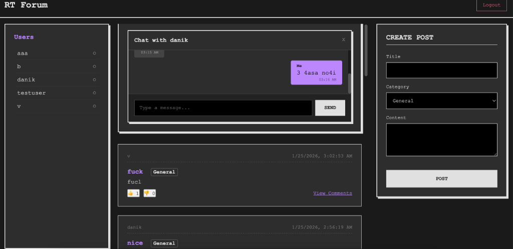

# Real-Time Forum SPA 🚀

A production-grade, Single Page Application (SPA) forum built from scratch using **Go**, **SQLite**, and **Vanilla JavaScript**. 

This project implements a custom **WebSocket architecture** for real-time private messaging, adhering to strict engineering constraints (No Frameworks, AV Rules, Modular Monolith Architecture).



---

## 🌟 Key Features

### 🔐 Authentication & Security
* **Dual-Login Support:** Users can sign in via **Nickname** or **Email**.
* **Secure Session Management:** HTTP-only cookies with UUID session tokens.
* **Encryption:** Passwords hashed using `bcrypt`.
* **Auth Guards:** Middleware protection for private routes and API endpoints.


### 📝 Core Forum Functionality
* **Posts:** Create and read posts with categorizations.
* **Comments:** Threaded discussions linked to specific posts.
* **SPA Navigation:** Seamless page transitions without reloads (Vanilla JS Router).

### 💬 Real-Time Private Chat (The "Boss" Feature)
* **Instant Messaging:** Zero-latency delivery via **WebSockets** (`gorilla/websocket`).
* **Live Online Status:** Sidebar updates in real-time to show who is online.
* **Smart Sorting:** Users list sorted by **Last Message Timestamp** (Discord-style), falling back to alphabetical.
* **Performance Optimization:**
    * **Throttling:** Scroll events are throttled (300ms) to prevent server spam during infinite scroll.
    * **Lazy Loading:** Chat history loads in batches of 10 messages.


---

## 🛠️ Tech Stack

### Backend (Go)
* **Language:** Go (Golang) 1.21+
* **Database:** SQLite3 (`github.com/mattn/go-sqlite3`)
* **WebSockets:** Gorilla WebSocket (`github.com/gorilla/websocket`)
* **Auth:** Bcrypt (`golang.org/x/crypto/bcrypt`) & UUID (`github.com/gofrs/uuid`)
* **Standard Lib:** Heavily relied upon for HTTP routing (`net/http`) and JSON handling.

### Frontend (Vanilla)
* **JavaScript:** ES6+ (No React, Vue, or jQuery).
* **CSS:** Minimalist/Brutalist design (<180 lines, Flexbox only).
* **HTML:** Single file (`index.html`) serving as the SPA shell.

---

## 🏗️ Architecture

The project follows a **Modular Monolith** architecture to ensure maintainability and adherence to **AV Rule 1** (No function > 200 lines).

```text
forum/
├── cmd/
│   └── server/
│       └── main.go       # Entry point: Wires DB, Config, and HTTP Server
├── internal/
│   ├── database/         # SQLite Singleton & Schema Migration
│   ├── models/           # Data Access Object (DAO) Layer (User, Post, Message)
│   ├── handlers/         # HTTP Transport Layer (Auth, API)
│   └── chat/             # WebSocket Engine
│       ├── hub.go        # Manages active clients & broadcasts
│       └── client.go     # Handles Read/Write pumps per connection
├── frontend/
│   ├── index.html        # The ONLY HTML file
│   └── static/           # JS & CSS assets
└── go.mod                # Dependency tracking
```

## 🚀 Getting Started

### Prerequisites
* Go 1.21 or higher
* GCC (required for `go-sqlite3` CGO)

### Installation
Clone the repository:
```bash
git clone https://01.tomorrow-school.ai/git/azhakysh/real-time-forum.git
cd real-time-forum
```

Install Dependencies:
```bash
go mod tidy
```

### Run the Application
```bash
go run cmd/server/main.go
```

Access the App: Open your browser and navigate to: `http://localhost:8080`

## 🧠 Technical Highlights (For Evaluators)
* **Custom Event Throttling:** To ensure smooth scrolling performance in the chat window, a custom toggle/throttle function was implemented in Vanilla JS. It limits the frequency of API calls when users scroll up to load history.
* **Concurrency Models:** The WebSocket Hub (`internal/chat/hub.go`) utilizes Go channels and Goroutines to manage concurrent connections safely, ensuring that a blocked client does not freeze the entire server.
* **Database Optimization:** All data retrieval uses explicit SQL JOINs to minimize round-trips to the database (N+1 problem avoidance).

## 📜 License
This project is open-source and available under the MIT License.
